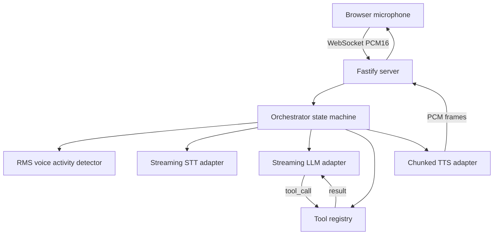
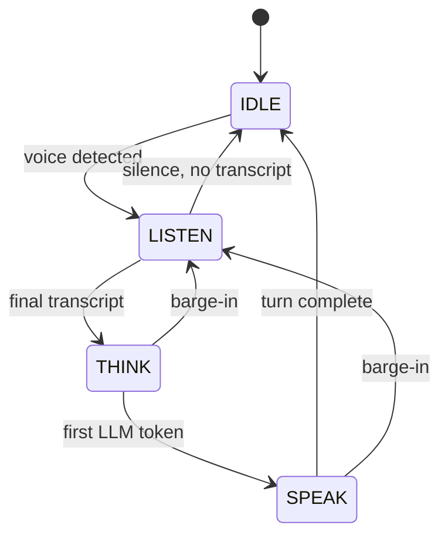

# Architecture

This is the design reference for the server pipeline. The [README](README.md) is the product page and the [wiki](https://github.com/sarmakska/voice-agent-starter/wiki) carries the deeper write-ups and troubleshooting.

## The loop

One voice session maps to one `Orchestrator` instance, created when the browser opens the `/voice` WebSocket and disposed when it closes. The orchestrator owns a four-state machine and never blocks: every provider call is a stream consumed with `for await`, and every cancellable operation is wrapped in an `AbortController`.

## State machine

1. **Capture.** The browser runs the microphone through an `AudioContext` resampled to 16kHz mono, converts each frame to PCM16, base64-encodes it, and sends a `{ type: 'audio', payload }` message. The orchestrator does not care which transport delivers the frames.
2. **Detect.** Each frame runs through the RMS-threshold VAD in `vad.ts`. When energy crosses the threshold the machine moves IDLE to LISTEN.
3. **Transcribe.** While in LISTEN, voice frames feed the selected STT adapter for live partials. Trailing silence past a frame threshold flushes the adapter for a final transcript, which triggers the move to THINK.
4. **Think.** The final transcript is appended to the conversation and streamed to the LLM adapter with the registered tools advertised. The first token flips the machine to SPEAK and is fed straight into TTS, so audio starts before the completion finishes.
5. **Speak.** The TTS adapter synthesises sentence by sentence and the orchestrator streams PCM chunks back to the client as base64. When the turn drains, the machine returns to IDLE.

## Barge-in

If the VAD detects speech while the machine is in THINK or SPEAK, the orchestrator aborts both the LLM and TTS streams through their `AbortController`s, resets the STT and TTS adapters, emits a `barge-in` control message, and drops to LISTEN. Because the abort signal propagates through the `fetch` body reader and the `for await` loops, there are no orphaned streams talking over the user.

## Function-call passthrough

The orchestrator advertises the registered tool definitions to the model on every LLM call. The shared SSE reader assembles fragmented `tool_calls` deltas into complete calls. When the model requests a tool, the orchestrator runs the matching handler from the `ToolRegistry`, appends an `assistant` turn recording the request and a `tool` turn carrying the result, and re-streams so the model can finish the turn with grounded data. Tool rounds are bounded by `maxToolRounds` to guard against loops, and handler errors are returned to the model rather than crashing the session.

## Adapters

Each layer is one TypeScript file behind a small interface, selected by an environment variable through a registry.

| Layer | Default | Alternatives | Interface |
|---|---|---|---|
| STT | Whisper.cpp (`whispercpp`) | Deepgram, OpenAI Whisper | `feed`, `flush`, `reset`, `id` |
| LLM | Groq Llama 4 (`groq`) | SarmaLink-AI, OpenAI | `stream`, `id` |
| TTS | OpenTTS Coqui XTTS v2 (`opentts`) | Cartesia, ElevenLabs | `feed`, `stream`, `end`, `reset`, `id` |

The three OpenAI-compatible LLM adapters share `sse.ts` for stream parsing and wire-format mapping, so adding a fourth OpenAI-compatible provider is a few lines. STT and TTS adapters share `audio.ts` for PCM/WAV conversion and sentence splitting.

## Components

| File | Responsibility |
|---|---|
| `apps/server/src/index.ts` | Fastify server, `/health` and `/voice` WebSocket, message dispatch |
| `apps/server/src/pipeline/orchestrator.ts` | Duplex state machine, barge-in, function-call passthrough |
| `apps/server/src/pipeline/tools.ts` | Tool registry and default tools |
| `apps/server/src/pipeline/vad.ts` | RMS-threshold voice activity detection |
| `apps/server/src/adapters/audio.ts` | PCM/WAV conversion, sentence splitting |
| `apps/server/src/adapters/llm/sse.ts` | OpenAI-compatible SSE reader and wire mapping |
| `apps/server/src/adapters/{stt,llm,tts}/*.ts` | Provider adapters and registries |
| `apps/web/app/page.tsx` | Browser client with microphone capture |

## Design choices

- **Plain WebSocket transport** rather than a WebRTC SFU. The orchestrator is transport-agnostic, so terminating over mediasoup or LiveKit is a swap at the edge without touching the pipeline. The starter keeps the transport simple on purpose.
- **Self-hosted defaults.** Groq, Whisper.cpp, and OpenTTS give a stack you can run end-to-end without per-minute provider fees, which is the right default for a starter.
- **Barge-in via AbortController** rather than queue cancellation, because abort signals propagate cleanly through `fetch` streams and `for await` loops.
- **Injectable adapters and a `Sink` seam** so the entire pipeline is testable without a live socket or provider keys.
