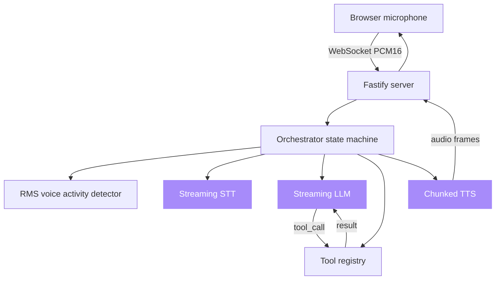

# voice-agent-starter

**A self-hosted, full-duplex voice agent loop with swappable streaming STT, LLM, and TTS.**

[](LICENSE)
[](https://github.com/sarmakska/voice-agent-starter)
[](https://github.com/sarmakska/voice-agent-starter/commits/main)

A working starter for production voice agents. The browser captures microphone audio, the server runs a duplex pipeline with voice activity detection, a streaming LLM answers, and TTS audio chunks back to the browser as they are synthesised. Barge-in cancels the in-flight LLM and TTS streams the moment you start speaking, and the LLM can call server-side tools mid-turn through function-call passthrough.

Every layer is a pluggable adapter behind a small interface, so you can swap Whisper.cpp for Deepgram, OpenTTS for ElevenLabs, or Groq for OpenAI without touching the pipeline. The defaults are a fully self-hosted, open-source stack with no per-minute provider fees: Groq Llama 4 for the LLM, Whisper.cpp for STT, and OpenTTS Coqui XTTS v2 for TTS.

## Quickstart

```bash
git clone https://github.com/sarmakska/voice-agent-starter.git
cd voice-agent-starter
pnpm install
cp .env.example .env
pnpm dev
```

Open `http://localhost:3000`, click Start, and grant microphone access. The web client connects to the server on port 3001 over a WebSocket and streams PCM frames into the pipeline. The state machine, barge-in, and tool calls all run without any provider keys; set keys or point the self-hosted URLs at running servers to get real transcripts and audio.

## Architecture



The orchestrator owns one voice session and runs an IDLE to LISTEN to THINK to SPEAK state machine. Full design notes and the state-transition table are in [ARCHITECTURE.md](ARCHITECTURE.md).

### Latency budget

| Stage | P50 target | Notes |
|---|---|---|
| Mic to VAD | 30ms | RMS VAD on PCM frames |
| STT first partial | 250ms | Whisper.cpp growing-window transcription |
| LLM first token | 250ms | Groq Llama 4 on the LPU stack |
| TTS first audio chunk | 250ms | OpenTTS XTTS v2, first sentence |
| Total user-perceived | **~800ms** | first audible response, self-hosted |

## What is in the box

- **Duplex orchestrator** (`apps/server/src/pipeline/orchestrator.ts`): an IDLE to LISTEN to THINK to SPEAK state machine that owns one voice session, hands the first LLM token straight to TTS, handles barge-in by aborting the LLM and TTS streams mid-flight, and runs function-call passthrough.
- **Function-call passthrough** (`apps/server/src/pipeline/tools.ts`): the LLM is advertised the registered tools, the server executes the matching handler, and the result is fed back so the model answers with grounded data. Ships with `get_time` and `add_numbers` and a clean seam for your own tools.
- **Voice activity detector** (`apps/server/src/pipeline/vad.ts`): an RMS-based VAD with a clean seam for dropping in silero-vad-onnx for real workloads.
- **Pluggable adapters** for STT (Whisper.cpp, Deepgram, OpenAI Whisper), LLM (Groq, SarmaLink-AI, OpenAI), and TTS (OpenTTS, Cartesia, ElevenLabs), each selected by an environment variable through a small registry. The three OpenAI-compatible LLM adapters share one streaming SSE reader.
- **Fastify 5 server** exposing a `/health` endpoint that reports the active providers and a `/voice` WebSocket, plus a **Next.js 15 web client** that captures audio and renders transcripts.
- **Real end-to-end tests**: the full pipeline driven through fake adapters and a fake socket, covering the loop, barge-in cancellation, and function-call passthrough, plus per-adapter unit tests. CI runs lint, typecheck, build, and tests on every push and pull request.

## When to use this

- You want to add voice to a product and do not want to build a streaming pipeline, barge-in handling, and a provider abstraction from scratch.
- You want a stack you can run fully self-hosted with no per-minute provider fees, and the option to swap in hosted providers per layer later.
- You need the LLM to call server-side functions mid-conversation and feed the results back into the same turn.
- You want to A/B test STT, LLM, or TTS providers without rewriting the pipeline around each one.

## When not to use this

- You need a finished consumer product. This is a starter, not a turnkey app, and the default VAD and transport are deliberately simple.
- You are building a one-shot, push-to-talk transcription tool. The full-duplex machinery here is overhead you would not need.
- You need word-level interim STT results today. The default Whisper.cpp adapter surfaces window-level partials; wire the Deepgram streaming SDK for finer granularity.

## Configuration

| Env var | Purpose | Default |
|---|---|---|
| `STT_PROVIDER` | `whispercpp`, `deepgram`, or `whisper` | `whispercpp` |
| `LLM_PROVIDER` | `groq`, `sarmalink`, or `openai` | `groq` |
| `TTS_PROVIDER` | `opentts`, `cartesia`, or `elevenlabs` | `opentts` |
| `GROQ_API_KEY` | for the Groq Llama 4 LLM adapter | unset |
| `WHISPERCPP_URL` | running whisper-server for STT | `http://localhost:8090` |
| `OPENTTS_URL` | running OpenTTS server for TTS | `http://localhost:5500` |

See [.env.example](.env.example) for the full list, including the hosted-provider keys.

## Swapping adapters

Each layer is one TypeScript file. Drop a new adapter into `apps/server/src/adapters/<layer>/<provider>.ts` implementing the interface, register it in the registry, and set the matching environment variable. No other changes. An OpenAI-compatible LLM adapter is a handful of lines because it reuses the shared SSE reader in `apps/server/src/adapters/llm/sse.ts`.

## Documentation

Full architecture notes, a sequence diagram, real-world examples, and a troubleshooting guide live in the [project wiki](https://github.com/sarmakska/voice-agent-starter/wiki). Design reference is in [ARCHITECTURE.md](ARCHITECTURE.md), the plan is in [ROADMAP.md](ROADMAP.md), and changes are in [CHANGELOG.md](CHANGELOG.md).

## License

MIT. Built by [Sarma Linux](https://sarmalinux.com).

---

## More open source by Sarma

Part of a portfolio of production-shaped open-source repositories built and maintained by [Sarma](https://sarmalinux.com).

| Repository | What it is |
|---|---|
| [Sarmalink-ai](https://github.com/sarmakska/Sarmalink-ai) | Multi-provider OpenAI-compatible AI gateway with 14-engine failover and intent-based plugin auto-routing |
| [agent-orchestrator](https://github.com/sarmakska/agent-orchestrator) | Durable multi-agent workflows in TypeScript with deterministic replay and Inspector UI |
| [voice-agent-starter](https://github.com/sarmakska/voice-agent-starter) | Self-hosted full-duplex voice agent loop. Pluggable streaming STT / LLM / TTS, barge-in, function-call passthrough |
| [ai-eval-runner](https://github.com/sarmakska/ai-eval-runner) | Evals as code. Python, DuckDB, FastAPI viewer, regression mode for CI |
| [mcp-server-toolkit](https://github.com/sarmakska/mcp-server-toolkit) | Production Model Context Protocol server starter (Python / FastAPI) |
| [local-llm-router](https://github.com/sarmakska/local-llm-router) | OpenAI-compatible proxy that routes to Ollama or cloud providers based on policy |
| [rag-over-pdf](https://github.com/sarmakska/rag-over-pdf) | Minimal end-to-end RAG starter for PDF corpora |
| [receipt-scanner](https://github.com/sarmakska/receipt-scanner) | Vision OCR for receipts with Zod-validated JSON output |
| [webhook-to-email](https://github.com/sarmakska/webhook-to-email) | Webhook receiver that forwards events to email via Resend |
| [k8s-ops-toolkit](https://github.com/sarmakska/k8s-ops-toolkit) | Helm chart for shipping Next.js to Kubernetes with full observability stack |
| [terraform-stack](https://github.com/sarmakska/terraform-stack) | Vercel + Supabase + Cloudflare + DigitalOcean modules in one Terraform repo |
| [staff-portal](https://github.com/sarmakska/staff-portal) | Open-source HR / ops portal for leave, attendance, expenses, and kiosk mode |

Engineering essays at [sarmalinux.com/blog](https://sarmalinux.com/blog). All projects at [sarmalinux.com/open-source](https://sarmalinux.com/open-source).
