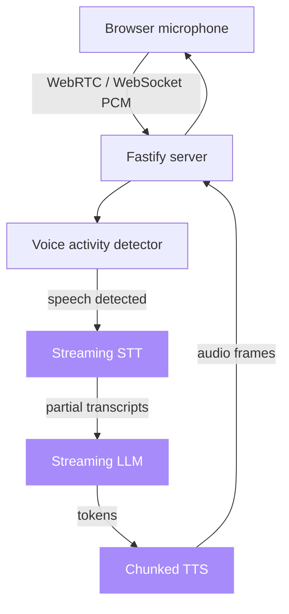

# voice-agent-starter

**Sub-second, full-duplex voice agent loop with swappable STT, LLM, and TTS.**

[](LICENSE)
[](https://github.com/sarmakska/voice-agent-starter)
[](https://github.com/sarmakska/voice-agent-starter/commits/main)

## What this is

A working starter for production voice agents. The browser captures microphone audio over WebRTC, the server runs a duplex pipeline with voice activity detection, partial transcripts feed a streaming LLM, and TTS audio chunks back to the browser as they are generated. Interruptions cancel the in-flight TTS and LLM streams and rewind the conversation cleanly, so barge-in behaves the way users expect.

Every layer is a pluggable adapter. STT, LLM, and TTS are each one TypeScript file behind a small interface, so you can swap Deepgram for Whisper, Cartesia for ElevenLabs, or SarmaLink-AI for OpenAI without touching the rest of the pipeline. The default stack targets a sub-second user-perceived round trip.

## Quickstart

```bash
git clone https://github.com/sarmakska/voice-agent-starter.git
cd voice-agent-starter
pnpm install
cp .env.example .env
pnpm dev
```

Open `http://localhost:3000`, click Start, and grant microphone access. The web client connects to the server on port 3001 over a WebSocket and streams PCM frames into the pipeline.

## What is in the box

- **Duplex orchestrator** (`apps/server/src/pipeline/orchestrator.ts`): an IDLE to LISTEN to THINK to SPEAK state machine that owns one voice session and handles barge-in by aborting the LLM and TTS streams mid-flight.
- **Voice activity detector** (`apps/server/src/pipeline/vad.ts`): an RMS-based VAD with a clean seam for dropping in webrtcvad-wasm or silero-vad-onnx for real workloads.
- **Pluggable adapters** for STT (Deepgram, Whisper), LLM (SarmaLink-AI, OpenAI), and TTS (Cartesia, ElevenLabs), each selected by an environment variable through a small registry.
- **Fastify 5 server** exposing a `/health` endpoint and a `/voice` WebSocket, plus a **Next.js 15 web client** that captures audio and renders transcripts.
- **A smoke test** for the VAD, a CI workflow that typechecks, builds, and tests on every push and pull request, and a pnpm workspace wired for parallel dev.

## Architecture



### Latency budget

| Stage | P50 target | Notes |
|---|---|---|
| Mic to VAD | 30ms | wasm VAD on a worker thread |
| STT first partial | 250ms | Deepgram Aura streaming |
| LLM first token | 200ms | SarmaLink-AI fast mode |
| TTS first audio chunk | 200ms | Cartesia Sonic streaming |
| Total user-perceived | **~600ms** | first audible response |

## When to use this

- You want to add voice to a SaaS product and do not want to build a WebRTC and streaming pipeline from scratch.
- You need barge-in handling that actually cancels in-flight output instead of talking over the user.
- You want to A/B test STT or TTS providers without rewriting the pipeline around each one.

## When not to use this

- You need a finished consumer product. This is a starter, not a turnkey app, and the default VAD and transport are deliberately simple.
- You are building a one-shot, push-to-talk transcription tool. The full-duplex machinery here is overhead you would not need.
- You require an on-device, fully offline pipeline today. The default adapters call hosted provider APIs, though the adapter seam makes a local swap straightforward.

## Configuration

| Env var | Purpose | Default |
|---|---|---|
| `STT_PROVIDER` | `deepgram` or `whisper` | `deepgram` |
| `TTS_PROVIDER` | `cartesia` or `elevenlabs` | `cartesia` |
| `LLM_PROVIDER` | `sarmalink` or `openai` | `sarmalink` |
| `SARMALINK_API_KEY` | for the SarmaLink-AI LLM adapter | unset |
| `DEEPGRAM_API_KEY` | for the Deepgram STT adapter | unset |
| `CARTESIA_API_KEY` | for the Cartesia TTS adapter | unset |

## Swapping adapters

Each layer is one TypeScript file. Drop a new adapter into `apps/server/src/adapters/<layer>/<provider>.ts` implementing the interface, register it in the adapter registry, and set the matching environment variable. No other changes.

## Documentation

Full architecture notes, a sequence diagram, real-world examples, and a troubleshooting guide live in the [project wiki](https://github.com/sarmakska/voice-agent-starter/wiki).

## License

MIT. Built by [Sarma Linux](https://sarmalinux.com).

---

## More open source by Sarma

Part of a portfolio of production-shaped open-source repositories built and maintained by [Sarma](https://sarmalinux.com).

| Repository | What it is |
|---|---|
| [Sarmalink-ai](https://github.com/sarmakska/Sarmalink-ai) | Multi-provider OpenAI-compatible AI gateway with 14-engine failover and intent-based plugin auto-routing |
| [agent-orchestrator](https://github.com/sarmakska/agent-orchestrator) | Durable multi-agent workflows in TypeScript with deterministic replay and Inspector UI |
| [voice-agent-starter](https://github.com/sarmakska/voice-agent-starter) | Sub-second full-duplex voice agent loop. WebRTC, mediasoup, pluggable STT / LLM / TTS |
| [ai-eval-runner](https://github.com/sarmakska/ai-eval-runner) | Evals as code. Python, DuckDB, FastAPI viewer, regression mode for CI |
| [mcp-server-toolkit](https://github.com/sarmakska/mcp-server-toolkit) | Production Model Context Protocol server starter (Python / FastAPI) |
| [local-llm-router](https://github.com/sarmakska/local-llm-router) | OpenAI-compatible proxy that routes to Ollama or cloud providers based on policy |
| [rag-over-pdf](https://github.com/sarmakska/rag-over-pdf) | Minimal end-to-end RAG starter for PDF corpora |
| [receipt-scanner](https://github.com/sarmakska/receipt-scanner) | Vision OCR for receipts with Zod-validated JSON output |
| [webhook-to-email](https://github.com/sarmakska/webhook-to-email) | Webhook receiver that forwards events to email via Resend |
| [k8s-ops-toolkit](https://github.com/sarmakska/k8s-ops-toolkit) | Helm chart for shipping Next.js to Kubernetes with full observability stack |
| [terraform-stack](https://github.com/sarmakska/terraform-stack) | Vercel + Supabase + Cloudflare + DigitalOcean modules in one Terraform repo |
| [staff-portal](https://github.com/sarmakska/staff-portal) | Open-source HR / ops portal for leave, attendance, expenses, and kiosk mode |

Engineering essays at [sarmalinux.com/blog](https://sarmalinux.com/blog). All projects at [sarmalinux.com/open-source](https://sarmalinux.com/open-source).
