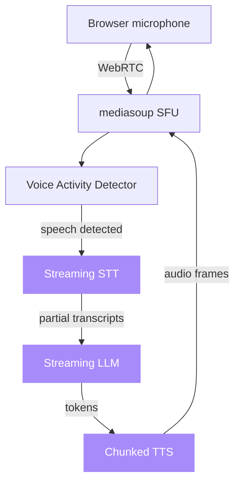

# voice-agent-starter

[](https://opensource.org/licenses/MIT)
[](https://nodejs.org)
[](https://typescriptlang.org)
[](https://fastify.dev)
[](https://mediasoup.org)
[](https://nextjs.org)
[](https://github.com/sarmakska/voice-agent-starter)

**Real-time voice agent loop. Sub-second round trip. STT, LLM, and TTS all swappable.**

Built by [Sarma Linux](https://sarmalinux.com).

---

## What this is

A working starter for production voice agents. Browser captures audio over WebRTC, server runs a duplex pipeline with VAD, partial transcripts feed a streaming LLM, TTS audio chunks back to the browser as they're generated. Interruptions cancel TTS and rewind LLM context cleanly.

Pluggable adapters for major STT, TTS and LLM providers. Defaults to SarmaLink-AI for the LLM layer. Swap any layer without touching the rest.

## What it solves

- "I want voice in my SaaS but I don't want to build a WebRTC stack from scratch"
- "I want barge-in handling that actually works"
- "I need to A/B test STT/TTS providers without rewriting the pipeline"

## Architecture



## Latency budget

| Stage | P50 target | Notes |
|---|---|---|
| Mic to VAD | 30ms | wasm VAD on a worker thread |
| STT first partial | 250ms | Deepgram Aura streaming |
| LLM first token | 200ms | SarmaLink-AI fast mode |
| TTS first audio chunk | 200ms | Cartesia Sonic streaming |
| Total user-perceived | **~600ms** | first audible response |

## Quick start

```bash
git clone https://github.com/sarmakska/voice-agent-starter.git
cd voice-agent-starter
pnpm install
cp .env.example .env
pnpm dev
```

Open `http://localhost:3000`, click "Start", grant microphone access.

## Configuration

| Env var | Purpose | Default |
|---|---|---|
| `STT_PROVIDER` | `deepgram` or `whisper` | `deepgram` |
| `TTS_PROVIDER` | `cartesia` or `elevenlabs` | `cartesia` |
| `LLM_PROVIDER` | `sarmalink` or `openai` | `sarmalink` |
| `SARMALINK_API_KEY` | for the SarmaLink LLM adapter | unset |
| `DEEPGRAM_API_KEY` | for the Deepgram STT adapter | unset |
| `CARTESIA_API_KEY` | for the Cartesia TTS adapter | unset |

## Swapping adapters

Each layer is one TypeScript file. Drop a new adapter into `apps/server/src/adapters/<layer>/<provider>.ts` implementing the interface, register it in the adapter registry, set the env var. No other changes.

## Roadmap

- [x] WebRTC capture with mediasoup SFU
- [x] VAD-driven barge-in
- [x] Streaming STT, LLM, TTS pipeline
- [x] Pluggable adapters per layer
- [ ] Multi-language hot swap mid-call
- [ ] Tool calling during voice (LLM emits structured calls)
- [ ] Native iOS / Android client (currently web only)

## License

MIT.

Built by [Sarma Linux](https://sarmalinux.com).
